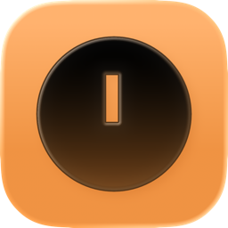
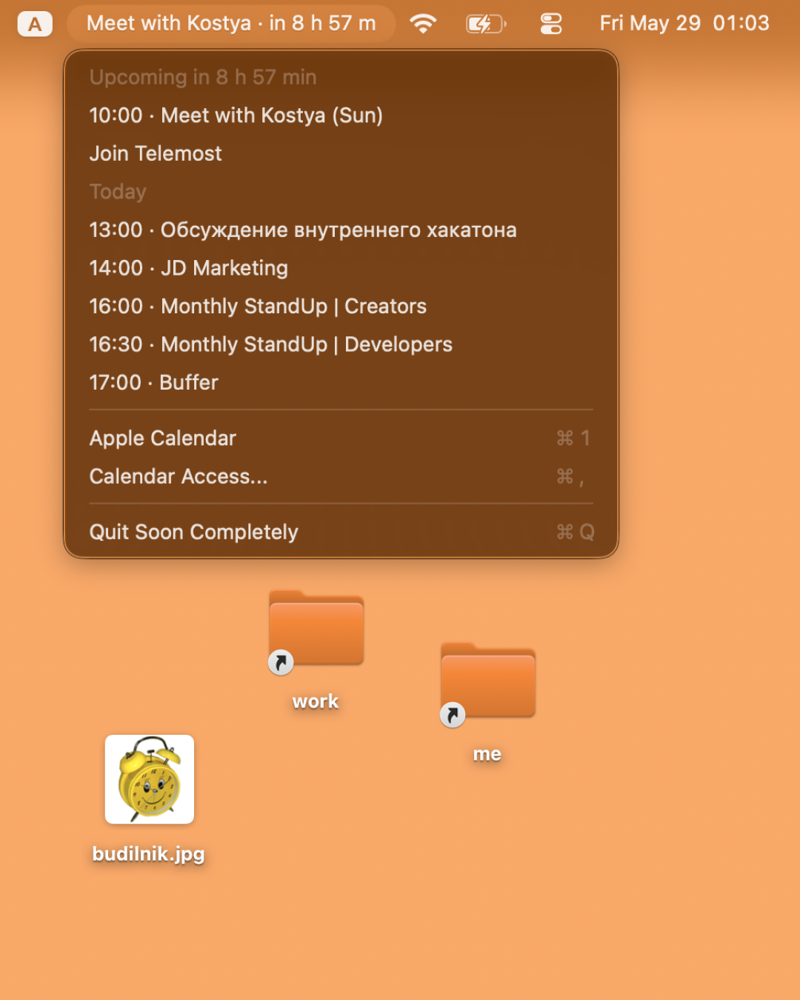

<table>
  <tr>
    <td width="132" valign="middle">
      
    </td>
    <td valign="middle">
      <h1>Soon</h1>
      <p>Soon is a tiny native macOS menu bar app for Apple Calendar. It shows your next event with a live countdown, keeps today and tomorrow one click away, and opens Apple Calendar when you need the full schedule.</p>
    </td>
  </tr>
</table>



## Highlights

- Native macOS menu bar app
- Apple Calendar integration through EventKit
- Live countdown for the next event
- System pull-down menu with today's and tomorrow's events
- Quick action to open Apple Calendar
- Fast refresh from Calendar change notifications plus a 5-second fallback check
- Adaptive source icon included as an Icon Composer `.icon` document

## Requirements

- macOS 26 or newer
- Xcode 26 or newer, or a recent Swift 6-compatible toolchain

## Install

Download `Soon.dmg` from the latest GitHub Release, open it, and drag `Soon.app` into Applications. On first launch, allow Calendar access.

## Run Locally

```bash
./script/build_and_run.sh
```

## Build A DMG

```bash
./script/package_dmg.sh
```

This creates `dist/Soon-1.1.dmg` and `dist/Soon.dmg`.

## Repository Layout

- `Sources/CalendarMenu/` Swift app source
- `Assets/Soon.icon/` adaptive Icon Composer source icon
- `docs/assets/` public brand assets used in the README
- `docs/demo/` public screenshot media used in the README
- `script/` local build and packaging scripts

## Privacy

Soon reads events from Apple Calendar using the system EventKit permission prompt. It does not require an account, server, or cloud sync of its own.

## License

Soon is available under the MIT License. See `LICENSE`.

## Stars


[](https://star-history.com/#maaatheeew/soon&Date)
