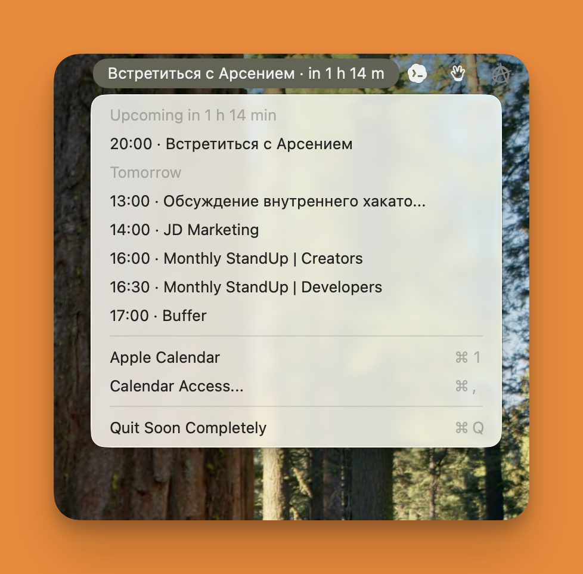

# Soon

<p align="center">
  
</p>

Soon is a tiny native macOS menu bar app for Apple Calendar.

It shows your next calendar event directly in the menu bar with a live countdown. Open the menu to see today and tomorrow, then jump into Apple Calendar when you need the full schedule.



## What It Does

- Reads events from the system Apple Calendar using EventKit.
- Shows the next event and countdown in the macOS menu bar.
- Shows only today and tomorrow in the menu.
- Opens Apple Calendar from the menu.
- Updates from system calendar change notifications, with a fast 5-second fallback refresh.

## Install

1. Download `Soon.dmg` from the GitHub release.
2. Open the DMG.
3. Drag `Soon.app` into Applications.
4. Launch Soon and allow Calendar access when macOS asks.

## Build Locally

```bash
./script/build_and_run.sh
```

To create the DMG:

```bash
./script/package_dmg.sh
```

## Icon

The adaptive source icon is included at `Assets/Soon.icon`. The build script exports it through Xcode's Icon Composer tooling and embeds `Soon.icns` in the app bundle for macOS distribution.
